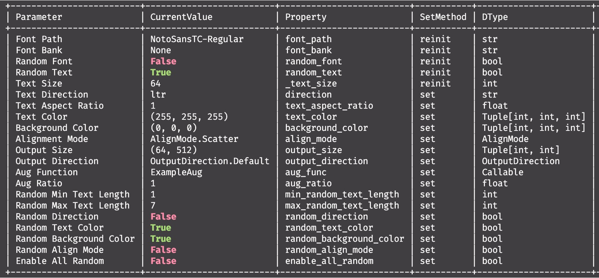

[English](./README.md) | **[中文](./README_tw.md)**

# WordCanvas

<p align="left">
    <a href="./LICENSE"></a>
    <a href="https://github.com/DocsaidLab/WordCanvas/releases"></a>
    <a href=""></a>
</p>

## 介紹

<div align="center">
    
</div>

本專案的核心功能為「**文字圖像生成工具**」，取名為 **WordCanvas**，即「文字畫布」的意思。

我們透過合成資料的方式，生成大量多樣性的中文文字圖像，以應對資料量不足、類別不平衡、缺乏多樣性等問題。對此我們參考了一些現有的文字合成工具，他們的設計方式帶給了我們很多啟發，讓我們決定從零開始創建了一個新的文字圖像生成器。

## 快速開始

套件安裝和使用的方式，請參閱 [**WordCanvas Documents**](https://docsaid.org/wordcanvas/intro/)。

## 引用

如果你認為我們的工作對你有幫助，請引用以下內容：

```bibtex
@misc{yuan2024wordcanvas,
  author = {Ze Yuan},
  title = {WordCanvas},
  year = {2024},
  publisher = {GitHub},
  journal = {GitHub repository},
  howpublished = {\url{https://github.com/DocsaidLab/WordCanvas}}
}
```
